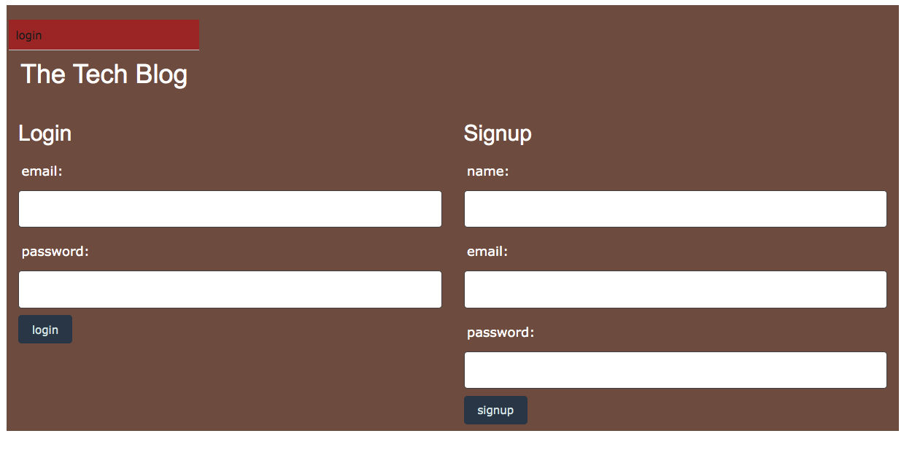
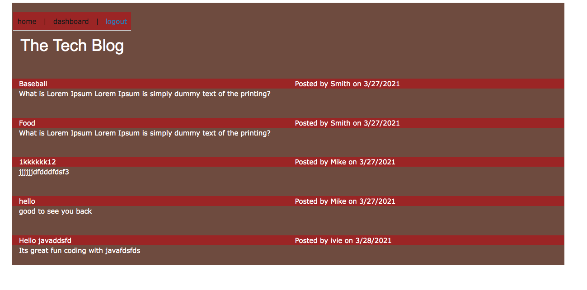
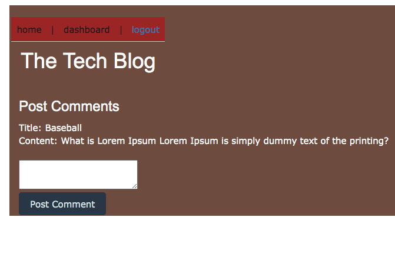

## License

# tech_blog
This app build a CMS-style blog site similar to a Wordpress site, where developers can publish their blog posts and comment on other developers’ posts as well. 

# Deployment

Link to the deployed website:

## Below are the screen shorts for website. 

##

## Technologies used
* Node
* Express
* MySQL
* Sequelize
* Dotenv

### Contact Detail 
Email-Id : deeapaligarg.chd@gmail.com

